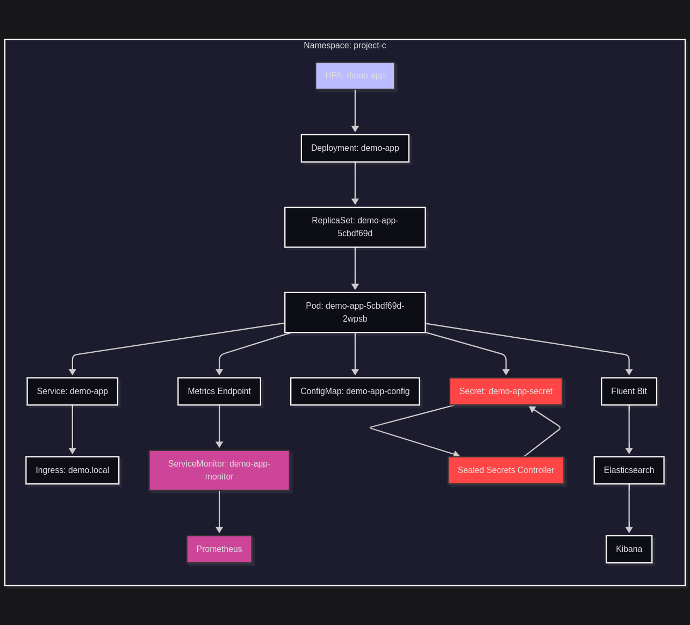
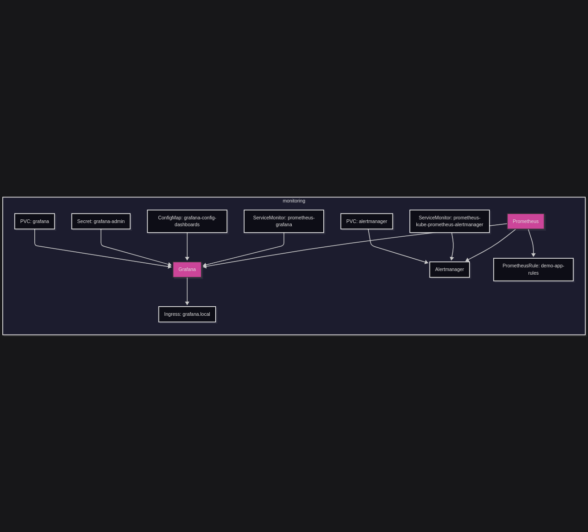
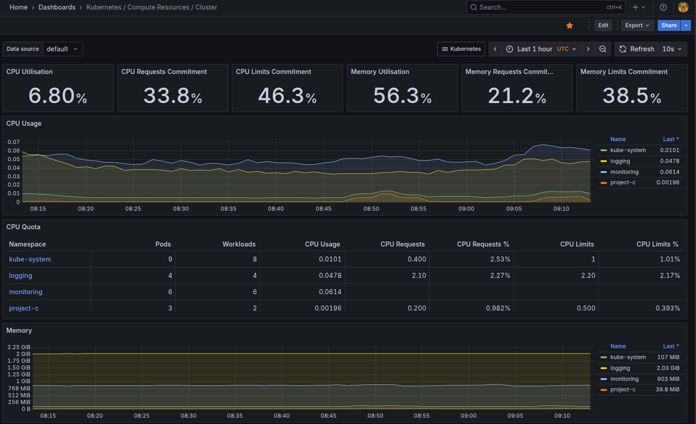
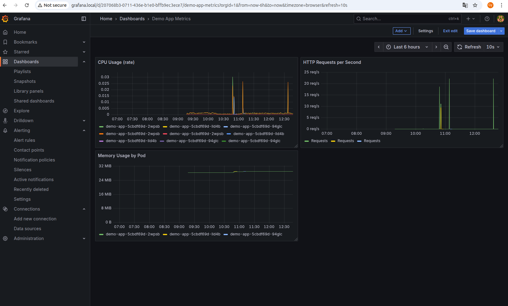
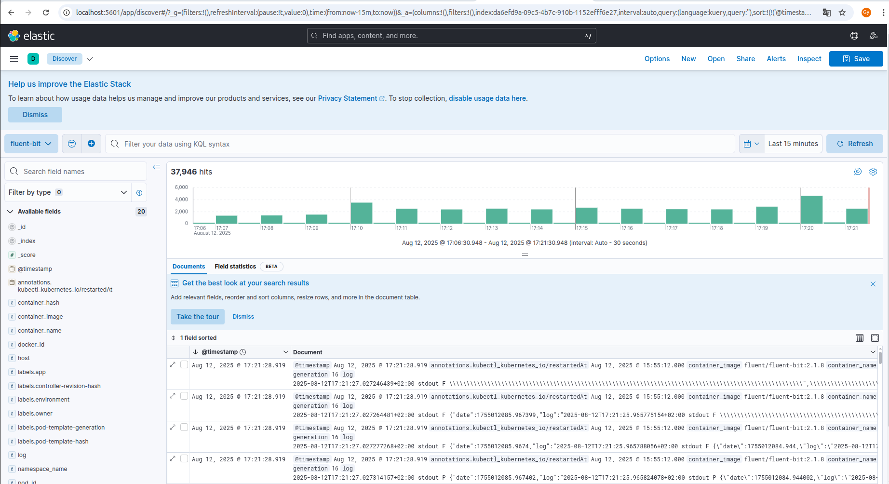

# 🚀 Project C: Local Kubernetes Cluster (k3s)

## 🌐 Overview

This project demonstrates the deployment of a containerized **Python Flask application** to a local **Kubernetes cluster powered by k3s**, featuring built-in monitoring, centralized logging, and reproducibility through Helm charts.

Designed for the **8-week TCS DevOps Internship**, it guides users from basic cluster setup to advanced observability tooling, culminating in a professional demo-ready environment.

## 🔧 Observability Tools

Key tools for metrics collection, visualization, and alerting:

- **Prometheus**
  - Scrapes application and cluster metrics.
  - Integrates with prometheus.local/alerts to trigger alerts based on defined thresholds.

- **Grafana**
  - Displays metrics via interactive dashboards.
  - Visualizes pod health, app-level metrics (CPU/Memory usage).

## 🪵 Logging Stack (EFK)

Centralized log management powered by the EFK stack:

- **Fluent Bit**
  - Collects container logs enriched with Kubernetes metadata.
  - Optimizes log payloads and ships them to Elasticsearch.

- **Elasticsearch**
  - Indexes and stores logs for fast querying and analysis.

- **Kibana**
  - UI for searching logs, filtering across namespaces, and building visualizations.

## 📦 Helm-Based Packaging

All components are managed using Helm, ensuring consistency and easy upgrades:

- Custom Helm chart for the Flask application
- Prometheus & Grafana via community Helm charts
- EFK stack optionally installed via Helm and custom YAML

### 📚 Context
This setup follows the 8-week **TCS DevOps Internship** progression, delivering a complete, local, end-to-end platform for deploying, monitoring, and troubleshooting a Python Flask app on k3s.

---

## 🗂️ Contents

- [Architecture Diagram](#architecture-diagram)
- [Quick Start](#quick-start)
- [Weekly Progression](#weekly-progression)
- [Monitoring & Logging Setup](#monitoring--logging-setup)
- [Demo & RBAC](#demo--rbac)
- [Tools and Versions](#tools-and-versions)

## 🧩 Architecture Diagram


> Prometheus connects the two layers of diagrams, facilitating observability and alerting.



```text
   ┌─────────────┐           ┌──────────────┐           ┌────────────┐
   │  Developer  │           │  Ingress     │           │  Grafana   │
   │  (Host)     ├──────────▶│  Controller  ├──────────▶│  Dashboards│
   └─────┬───────┘           └──────┬───────┘           └──────┬─────┘
         │                          │                          │
         ▼                          ▼                          ▼
┌─────────────────┐     ┌──────────────────┐      ┌───────────────────────┐
│  demo.local +   │     │ demo-app Service │      │ Prometheus + AlertMgr │
│  /etc/hosts     │     │  (ClusterIP)     │      │  (metrics scraping)   │
└─────────────────┘     └──────────────────┘      └───────────────────────┘
         │                          │                          ▲
         └────────────►────────────┴───────────────►──────────┘
                    k3s Cluster: Deployed via Helm
```
---

## Quick Start

```bash
# 1. Clone the repository
git clone https://github.com/<your-username>/<repo-name>.git && cd <repo-name>
# 2. Install k3s
curl -sfL https://get.k3s.io | sh -
# 3. Build and import the app image
docker build -t demo-app:v1 .
docker save demo-app:v1 | sudo k3s ctr images import -
# 4. Deploy using Helm
helm upgrade --install demo-app charts/demo-app -n project-c
helm upgrade --install grafana grafana/grafana -f grafana-values.yaml -n monitoring
# 5. Add /etc/hosts entries
echo "127.0.0.1 demo.local grafana.local prometheus.local" | sudo tee -a /etc/hosts
```

## Create GitHub repository

- went to https://github.com/new to create repository, tip: initialize with .gitignore
- Initialize Git locally: 
  `cd ~/project-c` 
  `git init`
- Add files and create a commit: 
  `git add .`
  `git commit -m "Initial commit: Project C k3s local cluster"`
- Connected my local repo to GitHub: 
  `git remote add origin https://github.com/<your-username>/<repo-name>.git`
- Generated a Personal Access Token
- Pushed my code to GitHub: 
  `git branch -M main` 
  `git push -u origin main`

## 📦 Week 1: Cluster Setup & Containerization

### ✅ Goals

- Install a local Kubernetes distribution (k3s).
- Containerize the Flask application.
- Verify cluster readiness and successful image build.

### 🛠️ Setup Commands

```bash
# Install k3s
curl -sfL https://get.k3s.io | sh -

# Verify cluster node
kubectl get nodes

# Create dedicated namespace
kubectl create namespace project-c
kubectl config set-context --current --namespace=project-c
```
### 🐳 Containerize Application
```bash
# Build Flask app image
docker build -t demo-app:v1 .

# Run locally to verify
docker run --rm -p 8080:8080 demo-app:v1
curl http://localhost:8080/

# Import into k3s containerd
docker save demo-app:v1 | sudo k3s ctr images import -
 ``` 
### ✅ Outcome
- Verified cluster via kubectl get nodes
- Flask app container image built and loaded

---

## 🚀 Week 2: Basic Kubernetes Deployment

### ✅ Goals

- Deploy containerized app via Kubernetes.
- Create Helm chart or YAML manifests.
- Validate service exposure and pod health.

### 📁 File Structure (trimmed)
```plaintext
project-c/
├── app/
│   └── app.py
├── charts/
│   └── demo-app/
│       └── dashboards
│           └── demo-app-dashboard.json
│       └── templates/
│           ├── configmap.yaml
│           ├── dashboard-provisioning-config.yaml
│           ├── demo-app-rules.yaml
│           ├── deployment.yaml
│           ├── grafana-ingress.yaml
│           ├── hpa.yaml
│           ├── ingress.yaml
│           ├── prometheus-ingress.yaml
│           ├── sealedsecret.yaml
│           ├── service.yaml
│           └── servicemonitor.yaml
│       ├── Chart.yaml
│       └── values.yaml
├── pictures/
├── Dockerfile
├── elasticsearch-values.yaml
├── fluent-bit-config.yaml
├── fluent-bit-daemonset.yaml
├── fluent-bit-rbac.yaml
├── grafana-values.yaml
├── kibana.yaml
├── fluent-bit-values.yaml
└── readonly.yaml
```

### 🧪 Helm Workflow
```bash
# Create chart scaffold
cd project-c/
helm create demo-app

# Lint and render templates
helm lint charts/demo-app
helm template demo-app charts/demo-app --namespace project-c
```
### 🔍 Verification
```bash
# Deploy resources
helm upgrade --install demo-app charts/demo-app -n project-c

# Check pods and services
kubectl get pods,svc -n project-c

# Test app response
kubectl port-forward svc/demo-app 8080:8080
curl http://localhost:8080/
```
### ✅ Outcome
- Application deployed to cluster
- Service reachable via port-forwarding or NodePort

## 🛠️ Week 3: Helm Chart & Configuration

### ✅ Goals

- Convert raw manifests into a reusable Helm chart.
- Parameterize key values (replica count, image tag, service type).
- Begin planning application exposure (Ingress, NodePort, etc.).

### 📦 Chart Customization

- Base chart scaffold: `helm create demo-app`
- Added configurable values to `values.yaml`:
  - `replicaCount`
  - `image.repository` and `image.tag`
  - `service.type`, `resources`, and `serviceAccount`
  - Stubbed autoscaling values for HPA template
- Included extra templates:
  - `configmap.yaml`, `sealedsecret.yaml`, `hpa.yaml`, `ingress.yaml`

### 🔐 Sealed Secrets Flow

```bash
# Install Sealed Secrets controller
kubectl apply -f https://github.com/bitnami-labs/sealed-secrets/releases/download/v0.25.0/controller.yaml

# Setup kubeseal binary
curl -LO https://github.com/bitnami-labs/sealed-secrets/releases/download/v0.27.1/kubeseal-0.27.1-linux-amd64.tar.gz
tar -xzf kubeseal-0.27.1-linux-amd64.tar.gz kubeseal
sudo mv kubeseal /usr/local/bin/
kubeseal --version
#make kubeseal executable
chmod +x kubeseal

# Create and seal secret
kubectl create secret generic demo-app-secret \
  --from-literal=API_TOKEN=newtoken \
  --from-literal=DB_PASSWORD=securepassword \
  -n project-c --dry-run=client -o yaml > demo-app-secret.yaml

kubeseal --format=yaml < demo-app-secret.yaml > demo-app-sealedsecret.yaml
kubectl apply -f demo-app-sealedsecret.yaml
```
### 🚀 Helm Release Verification
```bash
# Install and verify chart
helm upgrade --install demo-app ./charts/demo-app -n project-c
kubectl get all -n project-c
```

- Komodor Helm Dashboard installation for purpose Helm UI visualization:
```bash
  helm repo add komodorio https://helm-charts.komodor.io
  helm repo update
  helm install helm-dashboard komodorio/helm-dashboard -n kube-system --create-namespace
```

### ✅ Outcome
- App chart now reusable with parameterized configs.
- Secrets securely integrated via kubeseal.

---

## 🌐 Week 4: Ingress & Scaling

### ✅ Goals

- Expose the app via Ingress for browser access.
- Configure DNS/local host mapping.
- Add readiness/liveness probes and scale deployment.

### 🌍 Local DNS Setup

```bash
# Map domain to localhost
echo "127.0.0.1 demo.local" | sudo tee -a /etc/hosts

# Verify ingress routing
curl http://demo.local/
curl http://demo.local/healthz
curl http://demo.local/metrics
```
### 📈 Readiness & Scaling
- Configured probes in deployment.yaml:
  - livenessProbe and readinessProbe using /healthz

- Defined resource requests and limits:
```yaml
resources:
  requests:
    cpu: 100m
    memory: 128Mi
  limits:
    cpu: 250m
    memory: 256Mi
```
```bash
# added labels in deployment.yaml and Verifyed After Deploy:
  kubectl get deploy demo-app -n project-c -o yaml | grep -A 10 "labels:"
  kubectl get deploy demo-app -n project-c -o jsonpath="{.metadata.annotations}"
  kubectl label svc demo-app app=demo-app -n project-c --overwrite
# Helm Upgrade with Probes: 
  `helm upgrade demo-app charts/demo-app -n project-c`
#edited HPA template in templates/hpa.yaml, applied the Changes with `helm upgrade`
# Scaled deployment via Helm values or manually:
  `kubectl scale deploy/demo-app --replicas=3 -n project-c`

### 🔬 Verification & Testing
# Test logging and readiness
kubectl logs deployment/demo-app -n project-c
kubectl describe pod -l app=demo-app -n project-c
#check memry and cpu(cores)
kubectl top pod -n project-c
# Helm test
helm test demo-app -n project-c --timeout 180s --logs
```
  - output of test: 
    Phase:          Succeeded
    POD LOGS: demo-app-test-connection
    Connecting to demo-app:8080 … index.html saved

### ✅ Outcome
- App accessible via friendly domain demo.local.
- Probes operational; scaling validated through HPA or manual replica count.

## 📊 Week 5: Monitoring Integration (Prometheus & Grafana)

### ✅ Goals

- Deploy Prometheus and Grafana via Helm.
- Expose app metrics at `/metrics`.
- Scrape metrics using Prometheus.
- Build dashboards in Grafana.

### ⚙️ Setup Steps

```bash
# Add Helm repos
helm repo add prometheus-community https://prometheus-community.github.io/helm-charts
helm repo add grafana https://grafana.github.io/helm-charts
helm repo update

# Create monitoring namespace
kubectl create namespace monitoring

# 🚀 Install Prometheus & Grafana
# Install Prometheus
helm install prometheus prometheus-community/prometheus \
  --namespace monitoring \
  --set server.service.type=NodePort \
  --set alertmanager.service.type=ClusterIP

# Install Grafana
helm install grafana grafana/grafana \
  --namespace monitoring \
  --set service.type=NodePort \
  --set adminUser=admin \
  --set adminPassword=admin
```

### 🧬 App Metrics Endpoint
- Add annotations to service.yaml:

```yaml
metadata:
  annotations:
    prometheus.io/scrape: "true"
    prometheus.io/port: "8080"
    prometheus.io/path: "/metrics"
```
- Add /metrics route in app.py:

```python
@app.route('/metrics')
def metrics():
    metric = 'demo_app_custom_metric 1\n'
    return Response(metric, mimetype='text/plain')
```
🔁 Rebuild & Restart
```bash
docker rmi demo-app:v1
docker build --no-cache -t demo-app:v1 .
docker save demo-app:v1 | sudo k3s ctr images import -
kubectl rollout restart deployment/demo-app -n project-c
kubectl get pods -n project-c -o wide
kubectl logs -l app=demo-app -n project-c
```
- Verify Prometheus Pods & Services: 
  `kubectl get pods,svc -n monitoring`
- Port‑Forward to Access the Prometheus UI:
  `kubectl port-forward -n monitoring svc/prometheus-kube-prometheus-prometheus 9090:9090`
- Verify Grafana Resources:
  `kubectl get pods,svc -n monitoring | grep grafana`

### 📈 Grafana Setup
 `kubectl port-forward svc/grafana -n monitoring 3000:80`
- Add Prometheus as a data source.
- Create dashboards for:
  - Custom app metrics
  - Pod CPU/Memory
  - Cluster overview

- Deploying Grafana with `grafana.local` Ingress.
- created new values in the values.yaml for Grafana
- Added `/etc/hosts` entry:
  127.0.0.1 grafana.local
- Upgraded Grafana with the override
  `helm upgrade prometheus prometheus-community/kube-prometheus-stack -n monitoring -f values.yaml`
- run into issue: `ensure CRDs are installed first, resource mapping not found for name:` solution: 
```bash
kubectl apply --server-side -f https://raw.githubusercontent.com/prometheus-operator/prometheus-operator/main/example/prometheus-operator-crd/monitoring.coreos.com_alertmanagers.yaml
kubectl apply --server-side -f https://raw.githubusercontent.com/prometheus-operator/prometheus-operator/main/example/prometheus-operator-crd/monitoring.coreos.com_podmonitors.yaml
kubectl apply --server-side -f https://raw.githubusercontent.com/prometheus-operator/prometheus-operator/main/example/prometheus-operator-crd/monitoring.coreos.com_probes.yaml
kubectl apply --server-side -f https://raw.githubusercontent.com/prometheus-operator/prometheus-operator/main/example/prometheus-operator-crd/monitoring.coreos.com_prometheuses.yaml
kubectl apply --server-side -f https://raw.githubusercontent.com/prometheus-operator/prometheus-operator/main/example/prometheus-operator-crd/monitoring.coreos.com_prometheusrules.yaml
kubectl apply --server-side -f https://raw.githubusercontent.com/prometheus-operator/prometheus-operator/main/example/prometheus-operator-crd/monitoring.coreos.com_servicemonitors.yaml
kubectl apply --server-side -f https://raw.githubusercontent.com/prometheus-operator/prometheus-operator/main/example/prometheus-operator-crd/monitoring.coreos.com_thanosrulers.yaml
```
- rerun `helm upgrade` command
- created grafana-ingress.yaml: 
  `kubectl apply -f grafana-ingress.yaml`
```bash
# created servicemonitor.yaml for /metrics endpoint so Prometheus can watch it: 
  kubectl apply -f servicemonitor.yaml
# label to match ServiceMonitor selector
kubectl label svc demo-app app=demo-app -n project-c --overwrite
```
- Exposed app metrics with ServiceMonitor:
```yaml
  kind: ServiceMonitor
  namespaceSelector:
    matchNames: ["project-c"]
  selector:
    matchLabels:
      app: demo-app
```
- edited charts/demo-app/templates/service.yaml (name: http) so ServiceMonitor in servicemonitor.yaml can connect:
```yaml
  ports:
    - name: http
      port: {{ .Values.service.port }}
      targetPort: {{ .Values.service.port }}
```
- Verified `/metrics` is working in Prometheus and Grafana.
- changed to official Grafana chart: 
  `helm repo add grafana https://grafana.github.io/helm-charts`
  `helm repo update`
  `helm upgrade --install grafana grafana/grafana -f grafana-values.yaml -n monitoring`
- Grafana showing the memory and cpu usage of k3s and my app:

- just my app for clearer visibility:
 

## 🚨 Week 6: Advanced Monitoring, Alerts & Logging (Optional)

### ✅ Goals

- Configure alerting rules in Prometheus.
- Trigger alerts based on metric thresholds.
- Optionally deploy the EFK stack for centralized logs.

### 📊 Prometheus Alerts

```bash
# Create HPA
kubectl autoscale deployment demo-app \
  --cpu-percent=50 --min=1 --max=5 -n project-c

# Load test
sudo apt install apache2-utils
ab -n 1000 -c 50 http://demo.local/

# Watch scaling
kubectl get hpa -n project-c
kubectl get pods -n project-c -w
```

- Create demo-app-rules.yaml containing:
  - HTTP request threshold alert
  - CPU/memory usage alert
- Apply alert rules:
`kubectl apply -f demo-app-rules.yaml`
Update Prometheus data source:
http://prometheus-kube-prometheus-prometheus.monitoring.svc.cluster.local:9090
- Verified alert firing in Prometheus UI.
- Prometheus alerts in action:


### 🪵 Optional: EFK Stack Installation
```bash
# Create logging namespace
kubectl create namespace logging
```
### Deploy components:
```bash
# Elasticsearch
kubectl apply -f elasticsearch.yaml
kubectl apply -f elasticsearch-configmap.yaml
kubectl get pods -n logging -w

# Fluent Bit
kubectl apply -f fluent-bit-config.yaml
kubectl apply -f fluent-bit-daemonset.yaml
kubectl apply -f fluent-bit-rbac.yaml
kubectl get pods -n logging -l app=fluent-bit -w

# after making changes:
kubectl delete configmap fluent-bit-config -n logging
kubectl apply -f fluent-bit-config.yaml
kubectl delete pod -n logging -l app=fluent-bit
kubectl rollout restart daemonset/fluent-bit -n logging

# Kibana
kubectl apply -f kibana.yaml
kubectl rollout status deploy/kibana -n logging
kubectl port-forward -n logging svc/kibana 5601:5601

#verification
kubectl logs -n logging -l app=fluent-bit --tail=20
kubectl exec -n logging elasticsearch-master-0 -- curl -s http://localhost:9200/_cat/indices?v
kubectl get pvc -n logging
```
- check indices in Stack Management->Index Management, Create Data View with fluent-bit and once Kibana is showing logs in Discover page:
- The early flood was backlog ingestion; my steady-state is much lower.
- Most “big numbers” are Fluent Bit’s own logs. Exclude or drop the logging namespace to see the real app signal.
- demo-app is producing about 22 logs/min right now, which looks stable. 
- Fluent Bit DaemonSet tails /var/log/containers, enriches with Kubernetes metadata, de-escapes nested JSON (Lua filter), and ships to Elasticsearch.
- Elasticsearch stores logs in the fluent-bit index (or daily-rolled indices via Logstash format).
- Kibana Discover uses index pattern fluent-bit* for queries, filters, and saved searches.
- RBAC is applied to allow metadata enrichment across namespaces.
- log into kibana: 
  `kubectl port-forward svc/kibana -n logging 5601:5601`
- Create index pattern: fluent-bit* with the correct time field.
💡 Tip: Access Kibana via port-forward and create a Kibana index pattern (e.g., `fluent-bit*`) for quick log triage.


### ✅ Outcome
- Prometheus alerts visible in UI.
- App autoscales in response to load.
- Optional EFK stack provides searchable logs in Kibana.

## 🧹 Week 7: Final Refinements & Documentation

### ✅ Goals

- Review and clean configuration files.
- Finalize architecture diagrams and screenshots.
- Write step-by-step deployment and observability instructions.
- Create reproducible setup instructions for fresh environments.

### 📁 Review Checklist

- Verify Helm chart values and defaults.
- Ensure secrets, probes, and annotations are properly documented.
- Confirm all namespaces:
  - `project-c` for the app
  - `monitoring` for Prometheus & Grafana
  - `logging` (if EFK was deployed)

### 🖼️ Visual Assets

- Architecture diagram (app + observability flow)
- Screenshots:
  - Grafana dashboard with pod metrics
  - Prometheus alert firing view
  - Kibana query results for container logs

Placed assets in a `pictures/` folder and reference with relative paths in README.

### 🧪 Reproducibility

Test full setup from scratch:

```bash
# Full install flow
helm upgrade --install demo-app charts/demo-app -n project-c
helm upgrade --install prometheus prometheus-community/prometheus -n monitoring
helm upgrade --install grafana grafana/grafana -f grafana-values.yaml -n monitoring
```
- Reviewed all manifests and checked all resources:
  `kubectl get all,ingress,configmap,secret,pvc,servicemonitor -n project-c`
  `kubectl get all,ingress,configmap,secret,pvc,servicemonitor -n monitoring`
- Ensured Helm chart is reusable and parameterized.
- Created and documented custom dashboards in Grafana:
  - Application metrics
  - CPU usage
- Verified `helm upgrade` works with modified values.

### ✅ Outcome
- Finalized project docs with diagrams, screenshots, and reproducible flow.
- README serves as a deployment and troubleshooting guide.

## 🎬 Week 8: Demo Preparation & Delivery

### ✅ Goals

- Prep a clean demo-ready cluster.
- Walk through setup, scaling, and monitoring live.
- Submit full deliverables and final PDF report.
- Tested scaling and pod self-healing.
- Visualized app metrics in Grafana live.

- Option 1: Enable RBAC and create a read-only service account:
- created and applied readonly.yaml:
  `kubectl apply -f readonly.yaml`
- tested it to only list pods/services:
  `kubectl auth can-i list pods --as=system:serviceaccount:project-c:readonly-user -n project-c`
  `kubectl auth can-i create pods --as=system:serviceaccount:project-c:readonly-user -n project-c`
- Option 2: Run kube-bench locally for CIS benchmark scan:
  `docker run --rm -v /etc:/etc -v /var:/var --pid=host aquasec/kube-bench version`
  `docker run --rm -v /etc:/etc -v /var:/var --pid=host aquasec/kube-bench run`

### 🎤 Demo Flow
- Deploy Flask app using Helm.
- Access app via demo.local; test endpoints /, /healthz, /metrics.
- Scale replicas using Helm or HPA.
- Simulate load with Apache Bench and observe Grafana metrics.
- Trigger Prometheus alert and show it firing.
- (Optional) Query logs in Kibana using pod label filters.

### 📄 Submission Package
- README.md (final version)
- PDF export of documentation
- Helm chart(s)
- Screenshots and diagrams (stored in pictures/)
- Example dashboard JSON (Grafana)
- Secrets sample (sealed or templated)
- troubleshooting FAQ
### 🛠️ Troubleshooting Documentation

- Common issues to include:
- added Troubleshooting tips along the way in weekly work
- **Grafana panel empty**: Check `Prometheus > Targets`, and ensure metric is collected.
- **Ingress not routing**: Verify domain in /etc/hosts and Ingress resource
- **Pod not restarting**: Check `kubectl describe pod` for crash loop logs.
- **Alerts not firing**: Ensure rule syntax is valid and thresholds are crossed, simulate metric changes

### ✅ Outcome
- Demo rehearsed and delivered smoothly.
- Full documentation and project archive submitted.

## Tools and Versions

| Tool / Component        | Version                          |
|-------------------------|----------------------------------|
| k3s                    | v1.32.6+k3s1                     |
| Go (k3s build)         | go1.23.10                        |
| Helm                   | v3.18.4                          |
| kubeseal               | 0.27.1                           |
| Grafana (Helm Chart)   | grafana-9.3.0                    |
| Grafana App            | 12.1.0                           |
| Prometheus (Helm Chart)| kube-prometheus-stack-75.13.0   |
| Prometheus App         | v0.83.0                          |
| Python                 | Used via Docker (`python:3.10-slim`) |
| Flask                  | Installed via Dockerfile         |
| Prometheus Client      | Installed via Dockerfile         |

### 🧼 Cleanup

```bash
# Delete app and monitoring
helm uninstall demo-app -n project-c
helm uninstall grafana -n monitoring
helm uninstall prometheus -n monitoring
# Delete namespaces
kubectl delete ns project-c monitoring logging
# Reinstall everything from README steps
```