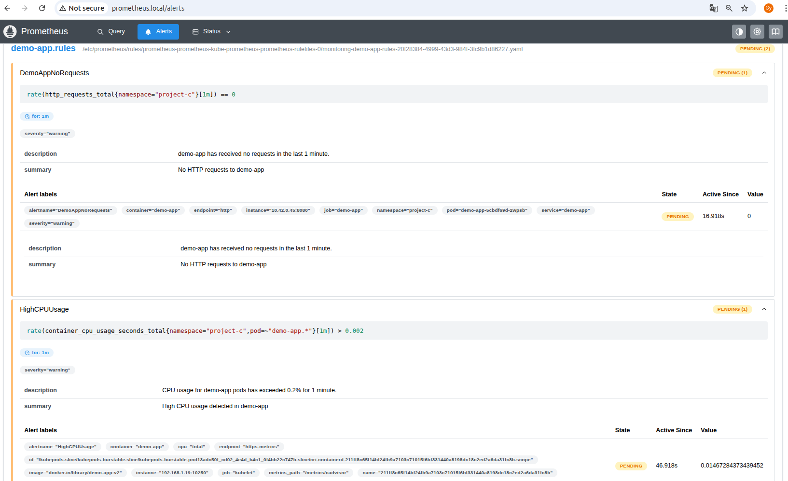

# Project C: Local Kubernetes Cluster (k3s)

## Overview

This project demonstrates deploying a containerized Flask application to a local Kubernetes cluster (k3s), with full observability using Prometheus and Grafana. The project follows the 8-week progression outlined in the TCS DevOps Internship Program. A complete end-to-end setup of a Kubernetes-based deployment using k3s, Helm, Prometheus, and Grafana to deploy and monitor a Python Flask application with custom metrics.

---

## 🗂️ Contents

- [Architecture Diagram](#architecture-diagram)
- [Quick Start](#quick-start)
- [Create GitHub repository](#create-github-repository)
- [Cluster Setup and Containerization(Week 1)](#cluster-setup-and-Containerization-week-1)
- [Basic Deployment (Week 2)](#basic-deployment-week-2)
- [Helm Chart (Week 3)](#helm-chart-week-3)
- [Ingress & Scaling (Week 4)](#ingress--scaling-week-4)
- [Monitoring Integration (Week 5)](#monitoring-integration-week-5)
- [Advanced Monitoring & Alerts (Week 6)](#advanced-monitoring--alerts-week-6)
- [Final Refinements & Docs (Week 7)](#final-refinements--docs-week-7)
- [Demo (Week 8)](#demo-week-8)
- [Troubleshooting](#Troubleshooting)
- [Tools and Versions](#Tools-and-Versions)
- [Cleanup](#Cleanup)

---
## Architecture Diagram


- Prometheus connects the 2 diagrams


---

```text
   ┌─────────────┐           ┌──────────────┐           ┌────────────┐
   │  Developer  │           │  Ingress     │           │  Grafana   │
   │  (Host)     ├──────────▶│  Controller  ├──────────▶│  Dashboards│
   └─────┬───────┘           └──────┬───────┘           └──────┬─────┘
         │                          │                          │
         ▼                          ▼                          ▼
┌─────────────────┐     ┌──────────────────┐      ┌───────────────────────┐
│  demo.local +   │     │ demo-app Service │      │ Prometheus + AlertMgr │
│  /etc/hosts     │     │  (ClusterIP)     │      │  (metrics scraping)   │
└─────────────────┘     └──────────────────┘      └───────────────────────┘
         │                          │                          ▲
         └────────────►────────────┴───────────────►──────────┘
                    k3s Cluster: Deployed via Helm
```
---

## Quick Start

```bash
# 1. Clone the repository
git clone https://github.com/<your-username>/<repo-name>.git && cd <repo-name>
# 2. Install k3s
curl -sfL https://get.k3s.io | sh -
# 3. Build and import the app image
docker build -t demo-app:v1 .
docker save demo-app:v1 | sudo k3s ctr images import -
# 4. Deploy using Helm
helm upgrade --install demo-app charts/demo-app -n project-c
helm upgrade --install grafana grafana/grafana -f grafana-values.yaml -n monitoring
# 5. Add /etc/hosts entries
echo "127.0.0.1 demo.local grafana.local prometheus.local" | sudo tee -a /etc/hosts
```

## Create GitHub repository

- went to https://github.com/new to create repository, tip: initialize with .gitignore
- Initialize Git locally: 
  `cd ~/project-c` 
  `git init`
- Add files and create a commit: 
  `git add .`
  `git commit -m "Initial commit: Project C k3s local cluster"`
- Connected my local repo to GitHub: 
  `git remote add origin https://github.com/<your-username>/<repo-name>.git`
- Generated a Personal Access Token
- Pushed my code to GitHub: 
  `git branch -M main` 
  `git push -u origin main`

## Cluster Setup and Containerization (Week 1)

- Installed k3s on local machine with: 
  `curl -sfL https://get.k3s.io | sh -`
- Verified the cluster is running with: 
  `kubectl get nodes`
- Created a Dedicated Namespace
  `kubectl create namespace project-c`
  `kubectl config set-context --current --namespace=project-c`
- Created Dockerfile for Flask app (`demo-app`) exposing `/metrics`.
- Built and loaded Docker image into k3s using:
  `docker build -t demo-app:v1 .`
  `docker run --rm -p 8080:8080 demo-app:v1`
  `curl http://localhost:8080/`
  `docker save demo-app:v1 | sudo k3s ctr images import -`
  

## Basic Deployment (Week 2)

- Created Kubernetes resources via Helm chart: 
  `cd project-c/` 
  `helm create demo-app`
- Deployment, Service, Ingress, Chart, Values, Hpa, etc. in a folder structure as below:
```plaintext
project-c/
├── charts/
│   └── demo-app/
│       ├── Chart.yaml
│       ├── values.yaml
│       └── templates/
│           └── dashboards
│               ├── demo-app-dashboard.json
│               └── original-dashboard.json
│           └── tests/
│               └── test-connection.yaml
│           ├── deployment.yaml
│           ├── service.yaml
│           ├── configmap.yaml
│           ├── dashboard-provisioning-config.yaml
│           ├── ingress.yaml
│           ├── hpa.yaml
│           ├── grafana-ingress.yaml
│           ├── prometheus-ingress.yaml
│           ├── servicemonitor.yaml
│           ├── demo-app-rules.yaml
│           ├── NOTES.txt
│           ├── _helpers.tpl
│           ├── sealedsecret.yaml
│           └── serviceaccount.yaml
├── app/
│   └── app.py
├── Dockerfile
├── grafana-values.yaml
├── fluentbit-values.yaml
├── readonly.yaml
└── README.md
```
- Lint & Template-Render: 
  `helm lint charts/demo-app`
  `helm template demo-app charts/demo-app --namespace project-c`
- Verified app was running:
  `kubectl port-forward svc/demo-app 8080:8080`

## Helm Chart (Week 3)

- Developed Helm chart in `charts/demo-app/`
- Parameterized values in `values.yaml`:
  - replicaCount
  - added serviceAccount:
            create: false
            name: ""
  - image.repository/tag
  - service type/port
  - Added an autoscaling stub so the HPA template has the keys it expects.
- created configmap.yaml and sealedsecret.yaml
  - configured values.yaml, deployment.yaml to include them, then ran: 
  `helm upgrade --install demo-app ./demo-app`
  `kubectl get configmap,secret,deploy,pod -n project-c`
  `kubectl apply -f https://github.com/bitnami-labs/sealed-secrets/releases/download/v0.25.0/controller.yaml`
  - Download the binary (version v0.27.1)
  `curl -LO https://github.com/bitnami-labs/sealed-secrets/releases/download/ v0.27.1/kubeseal-0.27.1-linux-amd64.tar.gz`
  - Extract the binary
  `tar -xzf kubeseal-0.27.1-linux-amd64.tar.gz kubeseal`
  - Make it executable and move to /usr/local/bin
  `chmod +x kubeseal`
  `sudo mv kubeseal /usr/local/bin/`
  - Confirm installation
  `kubeseal --version`
  `kubectl create secret generic demo-app-secret --from-literal=API_TOKEN=newtoken --from-literal=DB_PASSWORD=securepassword -n    project-c --dry-run=client -o yaml > demo-app-secret.yaml`
  `kubeseal --format=yaml < demo-app-secret.yaml > demo-app-sealedsecret.yaml`
  `kubectl apply -f demo-app-sealedsecret.yaml`
  `helm upgrade --install demo-app ./charts/demo-app -n project-c`
- Verified deployment and Installed my Helm Release with:
  `helm install demo-app charts/demo-app -n project-c`
- Verify Kubernetes Resources
  `kubectl get all -n project-c`
- Komodor Helm Dashboard installation: `helm repo add komodorio https://helm-charts.komodor.io`
  `helm repo update`
  `helm install helm-dashboard komodorio/helm-dashboard -n kube-system --create-namespace`

## Ingress & Scaling (Week 4)

- Installed Traefik ingress controller (already built into k3s).
- Configure Local DNS for Ingress:
  mapped demo.local to the k3s node’s IP. First, finding that IP:
  `kubectl get nodes -o wide -n project-c`
- Added `/etc/hosts` entry:
  127.0.0.1 demo.local
- tested the Ingress Endpoint: 
  `curl http://demo.local/metrics`
  `curl http://demo.local/` 
  `curl http://demo.local/healthz`
- added Liveness and readiness Probe in project-c/charts/demo-app/templates/deployment.yaml
  `kubectl top pod -n project-c`
- Defined CPU/Memory Requests & Limits:
  resources:
    requests:
      cpu: 100m
      memory: 128Mi
    limits:
      cpu: 250m
      memory: 256Mi
- added labels in deployment.yaml and Verifyed After Deploy:
  `helm upgrade --install demo-app ./charts/demo-app -n monitoring`
  `helm upgrade --install demo-app ./charts/demo-app -n project-c`
  `kubectl get deploy demo-app -n project-c -o yaml | grep -A 10 "labels:"`
  `kubectl get deploy demo-app -n project-c -o jsonpath="{.metadata.annotations}"`
- Helm Upgrade with Probes: `helm upgrade demo-app charts/demo-app -n project-c`
- Additional Sanity Checks
  `kubectl logs deployment/demo-app -n project-c`
  `kubectl describe pod -l app=demo-app -n project-c`
- Running the Built‑in Helm Test: 
  `helm test demo-app -n project-c --timeout 180s --logs`
  - output of test: 
    Phase:          Succeeded
    POD LOGS: demo-app-test-connection
    Connecting to demo-app:8080 … index.html saved
- edited HPA template in templates/hpa.yaml, applied the Changes with `helm upgrade`
- Verified scaling with `replicaCount: 3`.

## Monitoring Integration (Week 5)

- Add the Prometheus Helm Repository:
  `helm repo add prometheus-community https://prometheus-community.github.io/helm-charts`
  `helm repo update`
- Create the Monitoring Namespace
  `kubectl create namespace monitoring`
- Installed Prometheus with Helm:
  `helm install prometheus prometheus-community/prometheus --namespace monitoring --set  server.service.type=NodePort --set alertmanager.service.type=ClusterIP`
- Verify Prometheus Pods & Services: `kubectl get pods,svc -n monitoring`
- Port‑Forward to Access the Prometheus UI:
  `kubectl port-forward -n monitoring svc/prometheus-kube-prometheus-prometheus 9090:9090`
- Edited charts/demo-app/templates/service.yaml and added under metadata:
  annotations:
    prometheus.io/scrape: "true"
    prometheus.io/port:   "8080"
    prometheus.io/path:   "/metrics"
- Upgraded my app chart with `helm upgrade`
- modified app.py with this: 
  @app.route('/metrics')
  def metrics():
    metric = 'demo_app_custom_metric 1\n'
    return Response(metric, mimetype='text/plain')

- reBuild the image:
  `docker rmi demo-app:v1`
  `docker build --no-cache -t demo-app:v1 .`
- Import into k3s and restart:
  `docker save demo-app:v1 | sudo k3s ctr images import -`
  `kubectl rollout restart deployment/demo-app -n project-c`
  `kubectl get pods -n project-c -o wide`
  `kubectl logs -l app=demo-app -n project-c`

- Install Grafana & Build Your Dashboard, Added the Grafana Helm Repository:
  `helm repo add grafana https://grafana.github.io/helm-charts`
  `helm repo update`
- Installed Grafana in the monitoring Namespace: 
  `helm install grafana grafana/grafana --namespace monitoring --set service.type=NodePort --set   adminUser=admin --set adminPassword=admin`
- Verify Grafana Resources:
  `kubectl get pods,svc -n monitoring | grep grafana`
- Port‑Forward to Access Grafana: `kubectl port-forward svc/grafana -n monitoring 3000:80`
- Added Prometheus as a Data Source
- Created a Dashboard & Panel, Added a Pod CPU/Memory Panel
- Deploying Grafana with `grafana.local` Ingress.
- created new values in the values.yaml for Grafana
- Added `/etc/hosts` entry:
  127.0.0.1 grafana.local
- Upgraded Grafana with the override
  `helm upgrade prometheus prometheus-community/kube-prometheus-stack -n monitoring -f values.yaml`
- run into issue: `ensure CRDs are installed first, resource mapping not found for name:` solution:
  `kubectl apply --server-side -f https://raw.githubusercontent.com/prometheus-operator/prometheus-operator/main/example/prometheus-operator-crd/monitoring.coreos.com_alertmanagers.yaml`
  `kubectl apply --server-side -f https://raw.githubusercontent.com/prometheus-operator/prometheus-operator/main/example/prometheus-operator-crd/monitoring.coreos.com_podmonitors.yaml`
  `kubectl apply --server-side -f https://raw.githubusercontent.com/prometheus-operator/prometheus-operator/main/example/prometheus-operator-crd/monitoring.coreos.com_probes.yaml`
  `kubectl apply --server-side -f https://raw.githubusercontent.com/prometheus-operator/prometheus-operator/main/example/prometheus-operator-crd/monitoring.coreos.com_prometheuses.yaml`
  `kubectl apply --server-side -f https://raw.githubusercontent.com/prometheus-operator/prometheus-operator/main/example/prometheus-operator-crd/monitoring.coreos.com_prometheusrules.yaml`
  `kubectl apply --server-side -f https://raw.githubusercontent.com/prometheus-operator/prometheus-operator/main/example/prometheus-operator-crd/monitoring.coreos.com_servicemonitors.yaml`
  `kubectl apply --server-side -f https://raw.githubusercontent.com/prometheus-operator/prometheus-operator/main/example/prometheus-operator-crd/monitoring.coreos.com_thanosrulers.yaml`
- rerun `helm upgrade` command
- created grafana-ingress.yaml: 
  `kubectl apply -f grafana-ingress.yaml`
- Exposed app metrics with ServiceMonitor:
  kind: ServiceMonitor
  namespaceSelector:
    matchNames: ["project-c"]
  selector:
    matchLabels:
      app: demo-app
- Verified `/metrics` is working in Prometheus and Grafana.
- changed to official Grafana chart: 
  `helm repo add grafana https://grafana.github.io/helm-charts`
  `helm repo update`
  `helm upgrade --install grafana grafana/grafana -f project-c/values.yaml -n monitoring`
- Grafana showing the memory and cpu usage of k3s and my app:

- just my app for clearer visibility:
 

## Advanced Monitoring & Alerts (Week 6)

- created HPA: 
  `kubectl autoscale deployment demo-app --cpu-percent=50 --min=1 --max=5 -n project-c`
- tested under load with this load script: `sudo apt install apache2-utils`
  `ab -n 1000 -c 50 http://demo.local/`
- checking: 
  `kubectl get hpa -n project-c` 
  `kubectl get pods -n project-c -w`
- created servicemonitor.yaml for /metrics endpoint so Prometheus can watch it: 
  `kubectl apply -f servicemonitor.yaml`
- edited charts/demo-app/templates/service.yaml (name: http) so ServiceMonitor in servicemonitor.yaml can connect: 
  ports:
    - name: http
      port: {{ .Values.service.port }}
      targetPort: {{ .Values.service.port }}
- updated prometheus data source URL to: `http://prometheus-kube-prometheus-prometheus.monitoring.svc.cluster.local:9090`
- labeled service.yaml: 
  `kubectl label svc demo-app app=demo-app -n project-c --overwrite`
- created demo-app-rules.yaml with 2 prometheus alerts: 
  `kubectl apply -f demo-app-rules.yaml`
- Created PrometheusRule for:
  - `/metrics` http request threshold
  - CPU/memory usage threshold
- Verified alert firing in Prometheus UI.
- Prometheus alerts in action:



## Final Refinements & Docs (Week 7)
- created grafana-values.yaml to successfully use sealedsecret.yaml and then ran: 
  `helm upgrade --install grafana grafana/grafana -f grafana-values.yaml -n monitoring`
  `helm upgrade --install demo-app ./charts/demo-app -n project-c`
- Reviewed all manifests and checked all resources:
  `kubectl get all,ingress,configmap,secret,pvc,servicemonitor -n project-c`
  `kubectl get all,ingress,configmap,secret,pvc,servicemonitor -n monitoring`
- Ensured Helm chart is reusable and parameterized.
- Created and documented custom dashboards in Grafana:
  - Application metrics
  - CPU usage
- Verified `helm upgrade` works with modified values.
- Install EFK Stack 
  `kubectl create namespace logging`
- Add Helm Repos
  `helm repo add elastic https://helm.elastic.co`
  `helm repo add fluent https://fluent.github.io/helm-charts`
  `helm repo update`
- Deploy Elasticsearch
  `helm install elasticsearch elastic/elasticsearch -n logging  --set replicas=1  --set minimumMasterNodes=1  --set persistence.enabled=true --set resources.requests.memory=512Mi`
  `helm upgrade elasticsearch elastic/elasticsearch  -n logging  -f project-c/elasticsearch-values.yaml`
-  Deploy Kibana: created kibana.yaml and applied it
  `kubectl apply -f kibana.yaml`
- Deploy Fluent Bit:
  `kubectl apply -f fluent-bit-config.yaml`
  `kubectl apply -f fluent-bit-daemonset.yaml`
  `kubectl apply -f fluent-bit-rbac.yaml`
-after making changes:
  `kubectl delete configmap fluent-bit-config -n logging`
  `kubectl apply -f fluent-bit-config.yaml`
  `kubectl delete pod -n logging -l app=fluent-bit`
  kubectl rollout restart daemonset/fluent-bit -n logging
- log into kibana: 
  `kubectl port-forward svc/kibana -n logging 5601:5601`


## Demo (Week 8)
- Option 1: Enable RBAC and create a read-only service account:
- created and applied readonly.yaml:
  `kubectl apply -f readonly.yaml`
- tested it to only list pods/services:
  `kubectl auth can-i list pods --as=system:serviceaccount:project-c:readonly-user -n project-c`
  `kubectl auth can-i create pods --as=system:serviceaccount:project-c:readonly-user -n project-c`
- Option 2: Run kube-bench locally for CIS benchmark scan:
  `docker run --rm -v /etc:/etc -v /var:/var --pid=host aquasec/kube-bench version`
  `docker run --rm -v /etc:/etc -v /var:/var --pid=host aquasec/kube-bench run`

- Prepared clean deployment state.
- Tested scaling and pod self-healing.
- Visualized app metrics in Grafana live.

## Troubleshooting

- added Troubleshooting tips along the way in weekly work
- **Grafana panel empty**: Check `Prometheus > Targets`, and ensure metric is collected.
- **Pod not restarting**: Check `kubectl describe pod` for crash loop logs.
- **Alerts not firing**: Ensure rule syntax is valid and thresholds are crossed.

## Tools and Versions

| Tool / Component        | Version                          |
|-------------------------|----------------------------------|
| k3s                    | v1.32.6+k3s1                     |
| Go (k3s build)         | go1.23.10                        |
| Helm                   | v3.18.4                          |
| kubeseal               | 0.27.1                           |
| Grafana (Helm Chart)   | grafana-9.3.0                    |
| Grafana App            | 12.1.0                           |
| Prometheus (Helm Chart)| kube-prometheus-stack-75.13.0   |
| Prometheus App         | v0.83.0                          |
| Python                 | Used via Docker (`python:3.10-slim`) |
| Flask                  | Installed via Dockerfile         |
| Prometheus Client      | Installed via Dockerfile         |

## Cleanup

```bash
# Delete app and monitoring
helm uninstall demo-app -n project-c
helm uninstall grafana -n monitoring
helm uninstall prometheus -n monitoring
# Delete namespaces
kubectl delete ns project-c monitoring logging
```