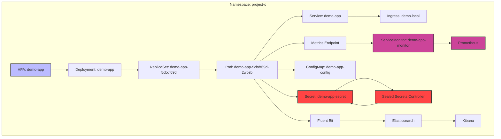
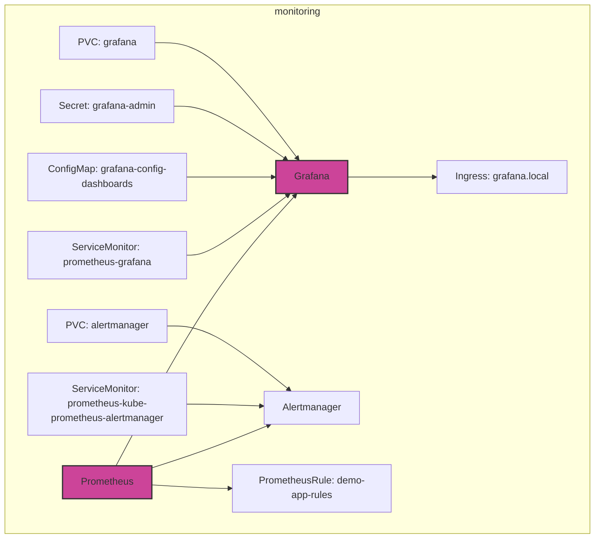

```mermaid
graph TD
  subgraph Namespace: project-c
    A[Deployment: demo-app] --> B[ReplicaSet: demo-app-5cbdf69d]
    B --> C[Pod: demo-app-5cbdf69d-2wpsb]
    C --> D[Service: demo-app]
    D --> E[Ingress: demo.local]
    C --> F[Metrics Endpoint]
    F --> G[ServiceMonitor: demo-app-monitor]
    G --> H[Prometheus]

    C --> I[ConfigMap: demo-app-config]
    C --> J[Secret: demo-app-secret]
    J --> K[Sealed Secrets Controller]
    K --> J

    L[HPA: demo-app] --> A

    C --> W[Fluent Bit]
    W --> X[Elasticsearch]
    X --> Y[Kibana]
  end

  style K fill:#f44,stroke:#333,stroke-width:2px
  style J fill:#f44,stroke:#333,stroke-width:2px
  style L fill:#bbf,stroke:#333,stroke-width:2px
  style G fill:#c49,stroke:#333,stroke-width:2px
  style H fill:#c49,stroke:#333,stroke-width:2px
```

```mermaid
graph TD
  subgraph monitoring
    H[Prometheus]
    M[Grafana]
    N[Ingress: grafana.local]
    O[Alertmanager]
    P[PrometheusRule: demo-app-rules]
    Q[ServiceMonitor: prometheus-kube-prometheus-alertmanager]
    R[ServiceMonitor: prometheus-grafana]
    S[ConfigMap: grafana-config-dashboards]
    T[Secret: grafana-admin]
    U[PVC: grafana]
    V[PVC: alertmanager]

    H --> M
    M --> N
    H --> O
    H --> P
    Q --> O
    R --> M
    S --> M
    T --> M
    U --> M
    V --> O

    style M fill:#c49,stroke:#333,stroke-width:2px
    style H fill:#c49,stroke:#333,stroke-width:2px
  end
```